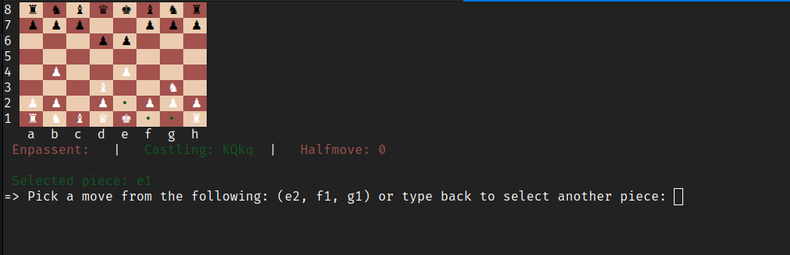
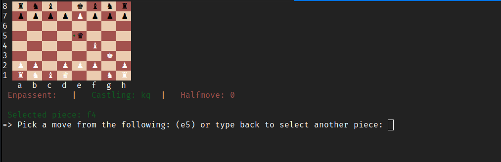
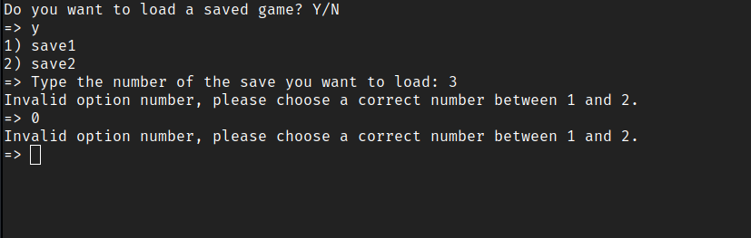

# Ruby Chess

a fully-featured, command-line based chess game written in ruby, offering the complete game experience.

> [!NOTE]  
> This game is optimized and tested for the **Linux terminal**. Piece colors may be displayed incorrectly on other terminal emulators or operating systems.

## Features

* **Move Validation:** Every piece follows its standard movement patterns.
* **Special Moves:**
    * **Castling:** King-side and Queen-side castling, if the King and Rook haven't moved and the path is clear & safe.
    * **En Passant:** En-Passent Pawn-capturing occurring immediately after a double-step pawn move.
    * **Pawn Promotion:** Promoting a pawn that reaches the end of the board.
* **Safe Move:** Prevents any move that would leave the player's King in check.
* **Game State Detection:** *Check*, *Checkmate*, and *Stalemate* detection.
* **Save/Load Functionality:** Save the game at any point, or load a game at the start.


## Preview

* **Castling:**
When castling move is available and safe it is added as a valid move option.


* **Safe Move:**
Moves that would leave or place your King in check are filtered out.


* **Loading:**
If only one save file exists, it's loaded automatically. Otherwise, a selection menu is displayed


---

## Installation

To run this project locally, ensure you have **Ruby** installed (version 3.4.6 recommended).

 1. Clone the repository:
 ```bash 
   git clone git@github.com:AReyad/ruby-chess.git
 ```
 2. Navigate to the directory:
 ```bash
    cd ruby-chess
 ```
 3. Run the game:
 ```bash
    ruby main.rb
 ```